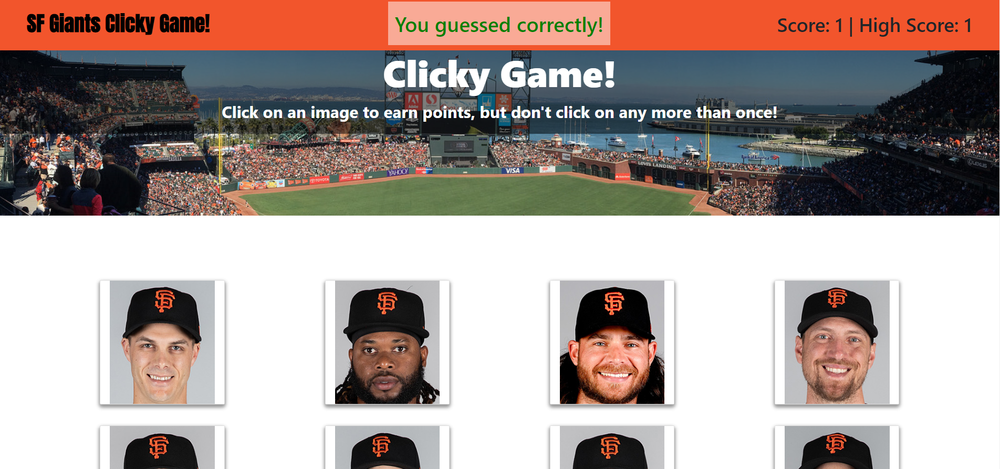

# clicky_game

[](https://github.com/dwyl/esta/issues)


## Description
Clicky Game is a memory where users play by clicking on different images. If the user clicks an image that has not been clicked on before, score increases by one. If the user clicks on an image that he/she has already clicked, the game is over and score is reset to 0.



## Table of Contents
* [Background](#background)
* [Approach](#approach)
* [Technology](#technology)
* [Site](#site)
* [License](#license)
* [Contributing](#contributing)
* [Questions](#questions)
* [Authors](#authors)


## Background

Clicky Game was built using React. It features UI that has been separated into components, managed component state, and it responds to user events.

Acceptance criteria for this app is as follows:

```
* The application should render different images to the screen. Each image should listen for click events.

* The application should keep track of the user's score. The user's score should be incremented when clicking an image for the first time. The user's score should be reset to 0 if they click the same image more than once.

* Every time an image is clicked, the images rendered to the page should shuffle themselves in a random order.

* Once the user's score is reset after an incorrect guess, the game should restart.

```

## Approach

The project featured the below areas of focus:
1) Randomizing pictures onclick
2) Modifying CSS when state changes
3) Identifying images that have been previously clicked on 

### Randomizing pictures

A key element in the gameplay of this application is when pictures are randomly reorganized after the user clicks an image. To accomplish this, the below code was used:
```
    handleRandom = () => {
        let image = this.state.Images;
        for (let i = image.length - 1; i > 0; i--) {
            const j = Math.floor(Math.random() * i)
            const temp = image[i]
            image[i] = image[j]
            image[j] = temp
        }
        this.setState({ Images: image })
    }
```
The above is effectively creating a copy of the Images array and then using the Fisher-Yates Algorithm to randomly change index values. The resulting "randomized" array is used to set the state of the Image array. As the page re-renders, the randomized array is then used to populate the images on page.

### Modifying CSS on state change

When a the user clicks on a correct or incorrect image, the title of the navbar changes text and formatting. The first step was to set props in the navbar:

```
<li className="list text-center">
                    <span className={props.style}>
                        {props.banner}
                    </span>
                </li>
```
props.style is then set in App.js:

```
<Navbar style={this.state.style} current={this.state.currentScore} high={this.state.highScore} banner={this.state.banner} />

```
We then use conditional rendering to change the style state depending on which image the user clicked on:

```
    handleCorrect = () => {
        this.setState({ banner: "You guessed correctly!" })
        this.setState({ style: "navbar-text correct" })
    }

    handleIncorrect = () => {
        this.setState({ banner: "You guessed incorrectly!" })
        this.setState({ style: "navbar-text incorrect" })
    }
```

The "correct" and "incorrect" classes are defined in style.css.

### Identifying images that have been previously clicked on

A majority of this apps functionality depends on identifying which images have already been clicked on. To do this, we start by capturing the id of the image that has been clicked:

```
props.handleIncrement(e.target.id)}/>
```

The above code, taken from the index.js in the ImageCard folder, shows how we capture the id of the image that is clicked on. We then use conditions in the below code depending on if the image has been clicked on or not:

```
 handleIncrement = (id) => {

        if (this.state.Clicked.includes(id)) {
            this.setState({ currentScore: 0 });
            this.setState({ Clicked: [] });
            this.handleIncorrect();
        }
        else {

            this.setState({ currentScore: this.state.currentScore + 1 });
            this.setState({ value: true })
            this.handleHighScore();
            this.handleRandom();
            this.handleState(id);
            this.handleCorrect();
        }

    };
```

The code below helps us update "Clicked" in state - an array used to keep track of the images that have been clicked. We start by copying the current array, pushing the id of the image that has been clicked, then setting the state of Clicked to the new array:

```
    handleState = (id) => {
        let newArray = this.state.Clicked;
        newArray.push(id);
        this.setState({ Clicked: newArray })
    }
```

## Technology

* [html5](https://developer.mozilla.org/en-US/docs/Web/Guide/HTML/HTML5)
* [CSS](https://developer.mozilla.org/en-US/docs/Web/CSS/Reference)
* [JS](https://developer.mozilla.org/en-US/docs/Web/JavaScript)
* [Bootstrap](https://getbootstrap.com/)
* [React](https://reactjs.org/)

## Site

* [See Live Site](https://cofchips.github.io/clicky_game/)

## License
MIT

## Contributing
Contributions are welcome. Please contact for further details.

## Questions
If you have any questions regarding this project, please email qiwei.mod@gmail.com.

## Authors

* **CHRISTOPHER LEE** 

- [Link to Github](https://github.com/CofChips)
- [Link to LinkedIn](https://www.linkedin.com/in/christophernlee/)
